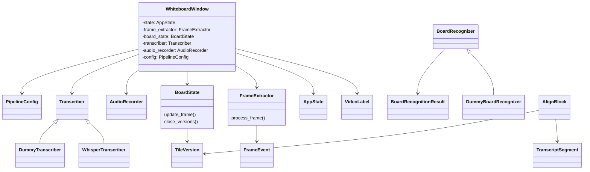

# Whiteboard Assist – Samlad dokumentation

Det här dokumentet sammanfattar README och designanteckningarna till en helhetsbild av projektet: vad det gör, hur du kör det, och hur AI-pipelinen är tänkt att fungera.

## Syfte och funktion
- Visa whiteboard via webbkamera med zoom/pan/keystone och menystyrning (PySide6 + OpenCV).
- Spela in ljud, extrahera nyckelbilder från tavlan och koppla tal (Whisper) med tavlans innehåll till ett exporterat dokument (Markdown → PDF/HTML).

## Krav
- **Funktionella:** transkribera tal med tidsstämplar; extrahera tavlans text/handstil/matte; spara ritblock som bilder; hantera occlusioner; versionera små ändringar; exportera tal + tavlans innehåll tidsmässigt.
- **Icke-funktionella:** klara 30–60 min inspelning med adaptiv sampling; robust mot brus/occlusion; utbyggbart (pluggbar vision/ljud-backend); minimera OCR-kostnad via tiles/stabilisering; stöd för offline-körning.

## Snabbstart
```bash
pip install -r Requirements.txt          # installera beroenden
python src/main.py                       # starta med kamera 0
python src/main.py -c 1                  # starta med kamera 1
python src/main.py --list-cameras        # lista kameror och avsluta
# Om Qt klagar på cocoa-plugin: kör via run.sh som sätter rätt Qt/DYLD-paths:
# ./run.sh
# Om det fortfarande krånglar: rensa QT_*/DYLD_* i terminalen och sätt env i samma kommando:
#   unset QT_PLUGIN_PATH QT_QPA_PLATFORM_PLUGIN_PATH QT_QPA_PLATFORM DYLD_FRAMEWORK_PATH DYLD_LIBRARY_PATH
#   QT_MAC_DISABLE_LIBRARY_VALIDATION=1 QT_QPA_PLATFORM_PLUGIN_PATH=.venv/lib/python3.12/site-packages/PySide6/Qt/plugins/platforms QT_PLUGIN_PATH=.venv/lib/python3.12/site-packages/PySide6/Qt/plugins DYLD_FRAMEWORK_PATH=.venv/lib/python3.12/site-packages/PySide6/Qt/lib DYLD_LIBRARY_PATH=.venv/lib/python3.12/site-packages/PySide6/Qt/lib QT_QPA_PLATFORM=cocoa python src/main.py
```

### Whisper offline (ingen nedladdning)
- Standardprofilen är `recommended` med Whisper `turbo`. Lägg `turbo.pt` i `whisper_models/` bredvid projektet eller sätt `WHISPER_MODEL_PATH=/full/path/till/turbo.pt`.
- Alternativt `WHISPER_MODEL_DIR=/path/till/katalog/med/modellen`.
- `ffmpeg` krävs för transkription (installera via t.ex. `brew install ffmpeg`).

## Arkitektur i korthet (MVC-inspirerad)
- **View/Controller:** `WhiteboardWindow` (`src/app.py`) + `VideoLabel` (Qt). Menyer för kamera, vy, keystone och hjälp. Mus/shortcuts kopplas till state.
- **Model:** `AppState` (`src/state.py`) håller zoom/pan, keystone, hörn, overlay, aktiva/tillgängliga kameror.
- **Bildpipeline:** `apply_keystone` (`src/keystone.py`) och `crop_zoom` (`src/zoom.py`); overlay ritas i `src/overlay.py`; kamerahantering i `src/capture.py`.
- **AI-paket:** `src/ai_pipeline/` hanterar ljud, frames, OCR/vision, align och export.

## Katalogstruktur (relevant)
- `src/app.py` – Qt-fönster, inspelning, statusbar, exporttrigger.
- `src/state.py` – AppState och inputhantering.
- `src/ai_pipeline/` – ljud, frames, tile-state, vision-backend, align, export, config.
- `captures/run-*/` – temporära sessioner (ljud, frames, manifest).
- `exports/session_*/` – färdiga exportsessioner för ChatGPT-underlag.

## AI-pipelinen (designsammanfattning)
- **Audio:** `AudioRecorder` spelar in WAV; `Transcriber`/`WhisperTranscriber` transkriberar med tidsstämplar.
- **Frames:** `FrameExtractor` tar keyframes via förändringsdetektion (SSIM/delta) + fallback-intervall (quick-läge 30 s).
- **Board state:** `BoardState` delar tavlan i tiles, versionerar ändringar, hanterar wipe/occlusion (framtida arbete).
- **Vision:** `BoardRecognizer`-interface i `vision.py` för text/handstil/matte; pluggbar backend (lokal/remote).
- **Align:** `align.py` kopplar transkriptsegment till tavlans innehåll och bilder (närmast i tid).
- **Export:** `export.py` renderar Markdown/HTML med tal + tavlans text/bilder.
- **Config:** `config.py` styr modellval, trösklar (SSIM), fallback-intervall, tile-grid, paths (quick/recommended/full_local-profiler).

## Tidsstämpling och sampling
- Förändringsdetektion via SSIM/delta på nedskalad tavla; nyckelbild när tröskel underskrids.
- Fallback-frame var N sekunder (quick: 30 s) om inget ändrats, så långsamma ändringar inte missas.
- Tvingad keyframe efter occlusion (när mask försvinner) och efter wipe.

## Occlusion, wipe och stabilisering
- Person-/huvudmask för att hoppa över skymda delar; ingen OCR på maskerade regioner.
- Wipe-detektion: ökning av ljusa pixlar/rörelse i tile → markera som rensad; nästa stabila innehåll blir ny version.
- Stabiliseringsfönster (ca 0.5–1 s utan förändring) innan OCR för att undvika halvskrivet eller pågående suddning.

## Datatyper (skiss)
- Transkription: `{start, end, text}`.
- Frame-event: `{ts, keyframe_path, occluded: bool}`.
- Tile-version: `{tile_id, start, end, text?, latex?, image_path?}`.
- Align-block: `{start, end, speech_text, board_text[], board_images[]}`.

## Session och robusthet
- Inspelning sparas under `captures/run-<timestamp>/` (ljud, frames, manifest).
- Inkrementella manifest/loggar för att kunna återuppta efter krasch; rensa först när export är klar (styrt av `keep_intermediates`).
- Export skapar ett stabilt sessionspaket under `exports/session_YYYY-MM-DD_HH-MM/`.

## Prestanda och resurser
- Snabb sampling/SSIM på CPU med nedskalade frames; tiles minskar OCR-belastning.
- Använd fp16/int8 där möjligt (Metal/CoreML på Apple Silicon; CUDA på Nvidia).
- På svag hårdvara: håll små modeller (Whisper tiny), färre tiles, längre fallback-intervall.

## Körprofiler
- **Quick:** Whisper tiny, nedskalad bild, adaptiv sampling + fallback var 30 s, 2x3 tiles.
- **Recommended (default):** Whisper turbo, balanserade trösklar, fallback var 20 s, 3x4 tiles.
- **Full local:** Whisper large, tätare sampling, fler tiles (4x5), högre lokal kvalitet.

## Körflöde (inspelning → export)
1) Starta AI-inspelning i appen (REC). Skapar `captures/run-<ts>/` med audio + frames.
2) Under inspelning: FrameExtractor triggar keyframes (förändring eller fallback). Audio spelas in parallellt.
3) Stoppa inspelning: postprocess körs – transkription, align, och export till `exports/session_YYYY-MM-DD_HH-MM/`.
4) Export inkluderar kopierade frames och audio för spårbarhet.

## Vidareutveckling (ur design.md)
- Rörelse/occlusionmask före OCR, tvingad keyframe efter occlusion.
- Wipe-detektion och stabiliseringsfönster per tile.
- Pluggbar cloud-backend (MathPix/GPT) för osäkra regioner.
- Matte till LaTeX, ritblock som bilder; topp-sammanfattning via språkmodell.

## UML (förenklad klassdiagram, kärnklasser)


## UML (ASCII-version)
```
+------------------+      +-------------+
| WhiteboardWindow |----->| VideoLabel  |
| - state: AppState|      +-------------+
| - frame_extractor|             ^
| - board_state    |             |
| - transcriber    |             |
| - audio_recorder |             |
| - config         |
+------------------+             |
   |    |    |    |    |         |
   v    v    v    v    v         |
 +--------+  +-----------+  +------------+
 |AppState|  |AudioRecorder| |PipelineCfg|
 +--------+  +-----------+  +------------+
      |           |              |
      |           v              |
      |      +-----------+       |
      |      |Transcriber|<------+
      |      +-----------+
      |       ^      ^
      |       |      |
      |   +-----------+-----------+
      |   |WhisperTranscriber     |
      |   |DummyTranscriber       |
      |   +-----------------------+
      v
+------------------+      +----------------+
| FrameExtractor   |----->|   FrameEvent   |
+------------------+      +----------------+
        |
        v
+------------------+      +----------------+
|   BoardState     |----->|  TileVersion   |
+------------------+      +----------------+
        ^
        |
 +-------------------------------+
 | AlignBlock (uses Transcript   |
 |  and TileVersion)             |
 +-------------------------------+

  BoardRecognizer (interface)
         ^
         |
 +-----------------------+
 | DummyBoardRecognizer  |
 +-----------------------+
  -> BoardRecognitionResult
```

## Status och backlog (2025-12-13)
- [x] Grundapp (PySide6) med kamera/keystone/zoom och capture-knappar.
- [x] Inspelning av ljud (sounddevice/PyAudio om finns, annars tom WAV) och rammanifest (`captures/run-*/manifest.json`).
- [x] FrameExtractor med enkel delta/fallback + export till stabil sessionsstruktur under `exports/session_*/`.
- [x] Manifest förbättrat: lagrar orsak (delta/interval/wipe/too_soon) och delta-värde per frame; hoppar över mörka/occluded frames.
- [x] Qt-startfix: sätter QT-plugin- och DYLD-sökvägar i koden istället för exec-restart.
- [x] Whisper språkstyrning: default svenska via `whisper_language` (kan ändras i config/env).
- [ ] Occlusion-/rörelsemask och wipe-detektion; tvingad keyframe efter occlusion.
- [ ] Tile-baserad BoardState med versionering per tile och stabiliseringsfönster; OCR/handstil/matte per tile.
- [ ] Förbättrad align: koppla transcript till tile-versioner och bilder före/efter inom tidsfönster.
- [ ] Export med rikare innehåll: LaTeX/text från tavlan, markerade wipe-händelser, samt PDF-rendering.
- [ ] Sammanfattning efter postprocess (LLM-hook när API-nyckel finns) och kort “key takeaways”/FAQ.
- [ ] Återuppta/efterbearbeta ofullständiga sessioner och mer detaljerad fel/statuslogg i manifest.
